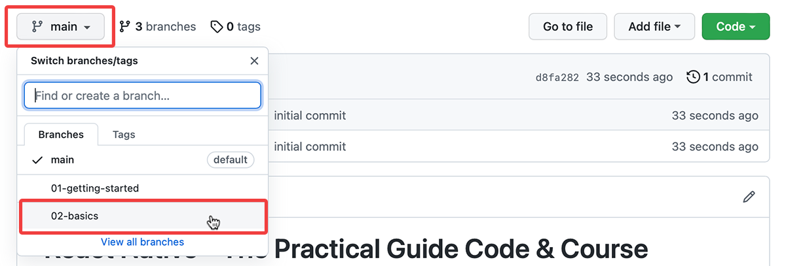

# React Native - The Practical Guide Code & Course Materials

This repository contains code snapshots and other attachments (e.g., slides) for our [React Native - The Practical Guide](https://acad.link/react-native) course.

You may use the provided resources to follow along with the course, debug your code or to compare your solution to Maximilian's. Re-distributing course materials (including the content provided with this repository) is not permitted.

# How To Use

This repository contains multiple [branches](https://docs.github.com/en/pull-requests/collaborating-with-pull-requests/proposing-changes-to-your-work-with-pull-requests/about-branches). Every branch represents a course section and contains the resources that belong to that section.

For example, the branch [02-basics](https://github.com/academind/react-native-practical-guide-code/tree/02-basics) contains all course resources (e.g., code snapshots) that belong to section 2 ("React Native Basics") of the course.

You can switch branches via the dropdown in the top left corner of this repository page:

# Provided Resources

In most branches (i.e., for most course sections), you find the following folders in the repository branch:

- **`/code`**: Contains multiple subfolders with different code snapshots for this course section (also see [Using Code Snapshots](#using-code-snapshots))
- **`/slides`**: Contains section slides (if slides were shown / used in the section)
- **`/extra-files`**: Contains any extra files that were used (e.g., image assets that were used in the section)

# Using Code Snapshots

Code snapshots (which you find in `/code`) are there for you to compare your code to mine and find + fix errors you might have in your code.

You can either view my code directly here on Github (you can open + view code files without issues here) or you download the snapshots. To download (or [clone](https://docs.github.com/en/repositories/creating-and-managing-repositories/cloning-a-repository)) the snapshots, simply use the **"Code" button** in the top right corner of the repository. This allows you to download the currently selected branch. You can then browse the code snapshots locally on your machine.

The subfolders in the `/code` folder are named such that mapping them to the course lectures is straightforward.

# Running The Provided Code

The provided code is primarily meant to be used for code comparisons (i.e., so that you can compare your code to mine to find + fix errors). 

But you can also run my project code by navigating into the respective code snapshots subfolder (i.e., a subfolder in the `/code` folder) and executing `npm install` followed by `npm start` there.

Please note that dependency mismatches could lead to errors here, even if the provided code itself still works and is correct. In addition, you will always need to bring your own backend URLs (e.g., Firebase) or API keys, if any were used in the course section!